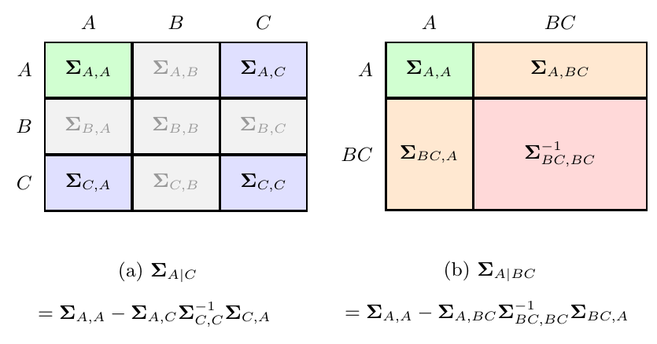
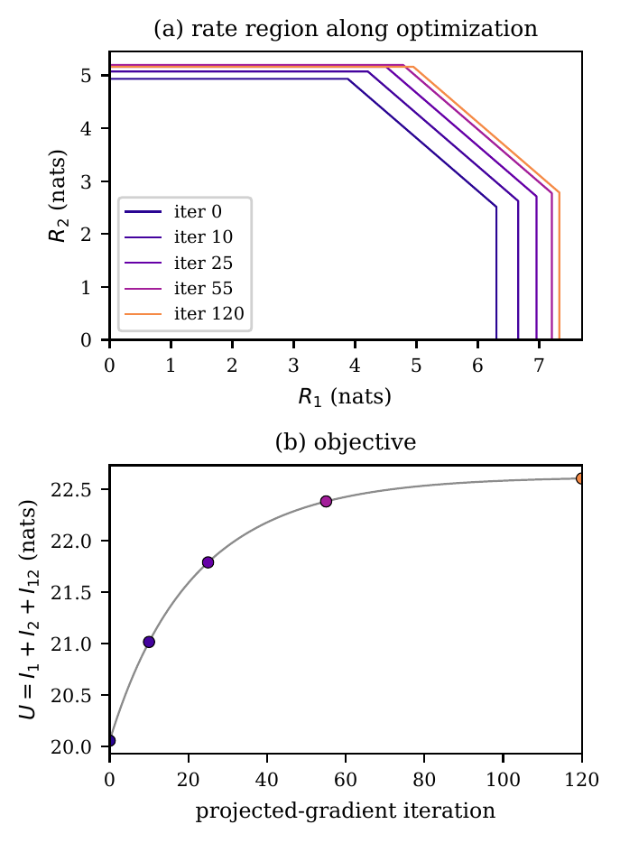
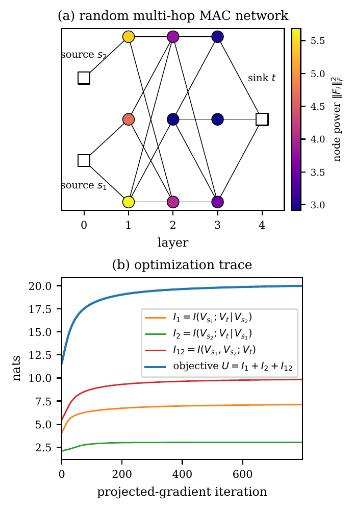

# cmi-dag

[](LICENSE)
[](https://www.python.org/)

Conditional mutual information and gradient-based optimization for
multi-terminal linear Gaussian directed acyclic graphs (DAGs).
Extends the single-root K-recursion to the **multi-root** case and
adds a closed-form **conditional mutual information** layer

```
I(V_A; V_B | V_C) = log det Σ_{A|C} − log det Σ_{A|BC},
```

for any disjoint node subsets `A, B, C`. On top of these primitives the
library ships a **rate-function evaluator** for general linear
combinations of conditional MIs,

```
f_T(η, H) = Σ_n α_{T,n} · I(V_{A_n}; V_{B_n} | V_{C_n}),
```

and a projected gradient **descent** loop `pga_descent` — the
minimization companion of the parent's `pga_ascent`.

The K-recursion forward pass produces every node-pair covariance block
in a single sweep; PyTorch's complex autograd then delivers the exact
Wirtinger gradient with respect to every controllable factor in the DAG
in a single backward sweep. No per-topology gradient derivation is
required. Every component is end-to-end differentiable, device-agnostic
(CPU / CUDA), and built on top of the parent library's numerical
primitives — there is no duplicated K-recursion or Cholesky code.

See [`MATH.md`](MATH.md) for a self-contained derivation of the
multi-root K-recursion, the block-extraction / Schur-complement
construction of conditional MI, the rate-region rate functions, the
composite sigmoid outage surrogate, and the projected gradient
optimization.

## Sister libraries

`cmi-dag` is one of four standalone members of the Gaussian-DAG
family, all sharing the same K-recursion / complex-autograd /
projected-gradient design and vendoring identical numerical primitives:

| Library | Scope | When to use |
| --- | --- | --- |
| [`gaussian-dag`](https://github.com/wadayama/gaussian-dag) | Single-pair MI on deterministic linear Gaussian DAGs (parent). | Single-link MIMO, multi-hop AF relay, diamond, input-covariance shaping. |
| [`cmi-dag`](https://github.com/wadayama/cmi-dag) | Multi-root + conditional MI on arbitrary disjoint subsets; rate-region facets. | MAC, BC, IC, wiretap, multi-terminal rate regions. |
| [`bussgang-dag`](https://github.com/wadayama/bussgang-dag) | Nonlinear node elements via Bussgang surrogate MI. | Soft-clipping PAs, low-resolution ADCs, hard-decision relays. |
| [`fading-dag`](https://github.com/wadayama/fading-dag) | Random channel matrices via mini-batched Monte Carlo; ergodic capacity and outage. | Rayleigh / Ricean / Kronecker-correlated fading. |

> **Funding.** This work was supported by JST, CRONOS, Japan
> Grant Number **JPMJCS25N5**.

---

## Requirements

- Python ≥ 3.12
- PyTorch ≥ 2.12 (the only runtime dependency)
- [`uv`](https://docs.astral.sh/uv/) for environment management (recommended)

`cmi-dag` is fully self-contained: it has **no `gaussian-dag` runtime
dependency**. The generic numerical primitives it shares with the parent
(`get_K`, `hermitianize`, `logdet_hpd`, `pga_ascent`, the projectors) are
vendored here, byte-identical to `gaussian-dag`'s.

## Installation

```bash
git clone https://github.com/wadayama/cmi-dag.git
cd cmi-dag
uv sync
```

This creates `.venv/` and installs all locked dependencies. Run any
subsequent command via `uv run python …` or `uv run pytest`.

Confirm the install:

```bash
uv run pytest
```

You should see all tests pass; one device-parameterised CUDA test is
skipped on CPU-only machines, which is expected.

To run the figure-reproduction examples, install the optional
`matplotlib` dependency:

```bash
uv sync --extra examples
```

---

## Repository layout

```
cmi-dag/
├── cmi_dag/     core library (4 modules + __init__)
├── tests/                pytest suite (37 tests, 6 files)
├── examples/             3 runnable scripts (paper-figure reproduction)
├── docs/                 5-part Markdown tutorial walkthrough
├── pyproject.toml        project metadata and dependencies (uv / pip)
├── LICENSE               MIT
├── MATH.md               self-contained mathematical foundations
└── README.md             this file
```

The subdirectories `examples/` and `docs/` carry their own short
READMEs. The optimisation framework (`pga_ascent` / `pga_descent`) and
projector primitives live in this package (`cmi_dag.optimize`,
`cmi_dag.projections`); for the single-root background and its derivation
see the parent library
[`gaussian-dag`](https://github.com/wadayama/gaussian-dag).

---

## Quick start

### Evaluate the three MAC pentagon conditional MIs

The 2-user MAC has two independent transmitter inputs `X_1, X_2` and
one receiver `Y`. As a multi-root DAG this is three nodes: `V_0 = X_1`
and `V_1 = X_2` are roots, and `V_2 = Y` is a non-root with both roots
as parents. The MAC pentagon's three rate-region facets are

```
I_1   = I(X_1; Y | X_2),
I_2   = I(X_2; Y | X_1),
I_12  = I(X_1, X_2; Y),
```

Each facet is `I(V_A; V_B | V_C) = log det Σ_{A|C} − log det Σ_{A|BC}`,
where the two conditional covariances are sub-block Schur complements
of the support covariance `Σ_{S,S}` over `S = A ∪ B ∪ C`:

<p align="center">
  
</p>

<p align="center"><em>Sub-block Schur complements of <code>Σ_{S,S}</code>: (a) <code>Σ_{A|C}</code> from the <code>A∪C</code> sub-block; (b) <code>Σ_{A|BC}</code> from the <code>A∪B∪C</code> sub-block. The CMI is <code>log det Σ_{A|C} − log det Σ_{A|BC}</code>, read in one call from the K-blocks of a single forward pass.</em></p>

In code each facet is then a single line:

```python
import torch
from cmi_dag import (
    compute_k_blocks_multiroot,
    conditional_mutual_information_from_k,
)

torch.manual_seed(0)
d, sigma = 2, 0.5
H_1 = torch.randn(d, d, dtype=torch.complex128)
H_2 = torch.randn(d, d, dtype=torch.complex128)
Sigma_root = torch.eye(d, dtype=torch.complex128)
Sigma_Z    = (sigma ** 2) * torch.eye(d, dtype=torch.complex128)

K = compute_k_blocks_multiroot(
    num_nodes=3,
    roots=[0, 1],
    parents={2: [0, 1]},
    edge_mats={(2, 0): H_1, (2, 1): H_2},
    root_covs={0: Sigma_root, 1: Sigma_root},
    noise_covs={2: Sigma_Z},
)
I_1  = conditional_mutual_information_from_k(K, A=[0],    B=[2], C=[1])
I_2  = conditional_mutual_information_from_k(K, A=[1],    B=[2], C=[0])
I_12 = conditional_mutual_information_from_k(K, A=[0, 1], B=[2], C=[])
print(f"I_1 = {I_1.item():.4f} nats")
print(f"I_2 = {I_2.item():.4f} nats")
print(f"I_12 = {I_12.item():.4f} nats")
```

For the scalar case (`d = 1`) the three values agree with the classical
`log(1 + SNR)` capacity formulas to machine precision (verified in
`tests/test_closed_form.py`).

### Optimize the MAC rate-region sum

Make the precoders `F_1, F_2` trainable, run projected gradient ascent
under a shared total-power budget:

```python
import torch
from cmi_dag import (
    compute_k_blocks_multiroot,
    evaluate_rate_functions,
    pga_ascent,
    project_total_power,
)

torch.manual_seed(0)
d, P = 4, 8.0
DTYPE = torch.complex128
H_1 = torch.randn(d, d, dtype=DTYPE)
H_2 = torch.randn(d, d, dtype=DTYPE)
scale = (P / (2.0 * d)) ** 0.5
F_1 = (scale * torch.eye(d, dtype=DTYPE)).clone().requires_grad_(True)
F_2 = (scale * torch.eye(d, dtype=DTYPE)).clone().requires_grad_(True)

pentagon = [
    [(1.0, [0],    [2], [1])],     # I_1
    [(1.0, [1],    [2], [0])],     # I_2
    [(1.0, [0, 1], [2], [])],      # I_12
]

def compute_U():
    K = compute_k_blocks_multiroot(
        num_nodes=3, roots=[0, 1], parents={2: [0, 1]},
        edge_mats={(2, 0): H_1 @ F_1, (2, 1): H_2 @ F_2},
        root_covs={0: torch.eye(d, dtype=DTYPE), 1: torch.eye(d, dtype=DTYPE)},
        noise_covs={2: torch.eye(d, dtype=DTYPE)},
    )
    I_1, I_2, I_12 = evaluate_rate_functions(K, pentagon)
    return I_1 + I_2 + I_12

history = pga_ascent(
    compute_U, [F_1, F_2],
    step_size=0.01, num_iters=120,
    projector=lambda ps: project_total_power(ps, P),
)
print(f"U: {history[0]:.4f} -> {history[-1]:.4f} nats")
```

The pentagon expands monotonically over the iterations. See
`examples/rate_region_maximization.py` for the full plotting code.

<p align="center">
  
</p>

<p align="center"><em>Joint precoder optimization on a 2-user vector Gaussian MAC: the rate-region pentagon expands monotonically over 120 projected-gradient iterations (top), while the facet-sum objective <code>U = I_1 + I_2 + I_{12}</code> rises in lock-step (bottom). One closure, three CMI calls, one backward sweep.</em></p>

---

## Public API

All symbols below are re-exported from the top-level package:

```python
from cmi_dag import (
    compute_k_blocks_multiroot,
    conditional_mutual_information_from_k,
    Summand, evaluate_rate_functions,
    pga_descent,
)
```

| Symbol | Module | Purpose |
| --- | --- | --- |
| `compute_k_blocks_multiroot(num_nodes, roots, parents, edge_mats, root_covs, noise_covs, *, symmetrize_self_blocks=True)` | `krecursion` | Forward pass of the K-recursion for a DAG with multiple independent roots `{0, …, K-1}`. Returns the canonical block dict `K[(j, k)]` (`j ≥ k`). Reduces to the parent's `compute_k_blocks` when `len(roots) == 1`. |
| `compute_effective_channel(num_nodes, roots, parents, edge_mats, noise_covs, *, source_dims=None, symmetrize_self_blocks=True)` | `krecursion` | Collapse the multi-root DAG to an equivalent multi-source channel `Y = Σ_r G_M^{(r)} X_r + R_M`. Returns `(G, C)`: per-root effective channel matrices `G[(r, j)]` (shape `d_j × d_r`, `G[(r,r)]=I`, `G[(r,r')]=0`) and effective-noise blocks `C[(j, k)]`. Satisfies `K_{jk} = Σ_r G_j^{(r)} Σ_r G_k^{(r)H} + C_{jk}`. Reduces to `gaussian_dag.compute_effective_channel` when `len(roots) == 1`. Differentiable. |
| `conditional_mutual_information_from_k(K, A, B, C=(), *, jitter=0.0)` | `information` | `I(V_A; V_B \| V_C) = log det Σ_{A\|C} − log det Σ_{A\|BC}` for arbitrary disjoint subsets `A, B, C` of the node set. Schur complement via `torch.linalg.solve`; log-det via the parent's Cholesky-based `logdet_hpd`. Differentiable. |
| `Summand` | `rate_region` | Type alias `tuple[float, Sequence[int], Sequence[int], Sequence[int]]` representing one term `α · I(V_A; V_B \| V_C)` of a rate function. |
| `evaluate_rate_functions(K, inequalities, *, jitter=0.0)` | `rate_region` | Evaluate a family of rate functions `f_T = Σ_n α_{T,n} · I(V_{A_n}; V_{B_n} \| V_{C_n})` from one K-recursion forward pass. Coefficient signs are unrestricted (negative `α` is fine; needed for HK and secrecy objectives). |
| `pga_descent(closure, params, *, step_size, num_iters, projector=None)` | `optimize` | Constant-step projected gradient **descent** on a user-supplied cost closure. Identical signature and history convention to `pga_ascent`; internally negates the closure and forwards. Returns history in the **true sign** of the objective (monotonically non-increasing on a successful descent). |

The underlying numerical primitives — `logdet_hpd`, `get_K`,
`hermitianize`, `pga_ascent`, `project_frobenius_ball`,
`project_total_power` — are provided directly by this package (vendored
from `gaussian-dag`, byte-identical) and are importable from `cmi_dag`
or its submodules (`cmi_dag.optimize`, `cmi_dag.projections`). No
`gaussian-dag` install is required.

### Conventions

- **Multi-root indexing.** Roots are the first `K` nodes
  `{0, 1, …, K-1}` (by topological-order convention); they must be a
  contiguous prefix of `{0, …, num_nodes-1}` and `K < num_nodes`
  (at least one non-root). Each root carries its own input
  covariance via `root_covs[r]`; the K-recursion base case enforces
  `K[(r, r')] = 0` for distinct roots (mutual independence).
- **Storage.** As in the parent, only canonical lower-triangular
  blocks are stored (`j ≥ k`). Use `cmi_dag.get_K(K, a, b)` for
  symmetric access; it applies the Hermitian flip `K_{ab} = K_{ba}^H`
  automatically.
- **Rate-function format.** A `Summand` is `(α, A, B, C)`; a rate
  function `f_T` is a list of summands; an inequalities-family is a
  list of rate functions. `evaluate_rate_functions(K, inequalities)`
  returns one differentiable scalar tensor per rate function, all
  derived from the same K-blocks (one forward pass shared across the
  family). Negative `α` is permitted: the optimization framework
  needs only differentiability of `f_T` in the design parameters, not
  concavity or monotonicity.
- **Sign convention for `pga_descent`.** `pga_descent` minimises
  whatever real scalar the closure returns; the returned history is
  in the true sign of that cost (monotonically non-increasing on a
  successful descent). Internally it forwards to
  `cmi_dag.pga_ascent` after negation and flips the history
  sign. Use `pga_descent` when your natural objective is a *cost*
  (leakage, distortion, outage surrogate); use `pga_ascent` when it
  is a *benefit* (rate-region facet sum, MI). Same signature in both
  cases.
- **Complex autograd.** Inherited from the parent. For a complex
  leaf `Θ` and a real scalar loss `L`, PyTorch's `.grad` equals
  `2 · ∂L/∂Θ*` (the Wirtinger gradient without the 1/2 factor; the
  real-Euclidean steepest direction on `Re Θ, Im Θ`). The factor of 2
  is absorbed into the step size of both `pga_ascent` and
  `pga_descent`.
- **Units.** All MI values are in **nats**.
- **Domain failures.** Like the parent, the library requires the
  conditional covariances `Σ_{A|C}` and `Σ_{A|BC}` to be strictly
  Hermitian positive-definite. Cholesky failures surface as a
  diagnostic `ValueError` (not an autograd-internal NaN). Mitigate
  with `jitter > 0` in the CMI / rate-function calls, or by ensuring
  the noise covariances at all non-root nodes are strictly PD.

---

## Examples and figure reproduction

Each script under [`examples/`](examples/) is self-contained, writes
its results to `examples/results/<name>.npz`, and renders a figure to
`examples/figures/<name>.pdf`. Total wall-clock for all three on CPU is
under 15 seconds.

| Command | What it demonstrates |
| --- | --- |
| `uv run python examples/rate_region_maximization.py` | Joint optimization of two per-user precoders on a 2-user MIMO MAC; the rate-region pentagon expands monotonically over 120 PGA iterations. |
| `uv run python examples/secure_precoding.py` | Sign-indefinite secrecy-rate objective `I(X; Y) − I(X; Z)` on a MIMO wiretap channel; the precoder shapes its subspace to drive eavesdropper information down while keeping legitimate information high. |
| `uv run python examples/random_mac.py` | The same MAC-facet-sum objective scaled to a randomly generated 12-node multi-hop multi-source network with 9 relay processing matrices and a single shared total-power budget. |

<p align="center">
  
</p>

<p align="center"><em>Output of <code>examples/random_mac.py</code>: (a) a randomly generated 12-node multi-source multi-hop DAG with two source roots <code>s_1, s_2</code> and one sink <code>t</code>; node colour encodes the per-node Frobenius norm <code>‖F_i‖^2_F</code> after optimization. (b) The three pentagon facets and the facet-sum objective <code>U</code> rise jointly under projected-gradient ascent — the same loop as the 2-user MAC example above, with no per-topology code change.</em></p>

See [`examples/README.md`](examples/README.md) for output conventions
and reproducibility notes.

---

## Tutorials

A five-part beginner walkthrough is available under [`docs/`](docs/README.md):

1. [Installation and your first conditional MI](docs/tutorial-1-installation-and-first-cmi.md)
2. [Multi-root K-recursion and conditional covariance](docs/tutorial-2-multi-root-and-conditional-covariance.md)
3. [Rate functions and PGA on multi-terminal objectives](docs/tutorial-3-rate-functions-and-pga.md)
4. [Sign-indefinite objectives and `pga_descent`](docs/tutorial-4-sign-indefinite-and-pga-descent.md)
5. [Reproducing the random multi-hop MAC figure](docs/tutorial-5-reproducing-random-mac.md)

Working through the parent library's
[tutorial series](https://github.com/wadayama/gaussian-dag/tree/main/docs)
first will make these substantially easier — the parent introduces the
single-root K-recursion, log-det MI, projected gradient ascent, and
projector primitives that this library extends.

---

## GPU support

The library is **device-agnostic**: every internally allocated tensor
(the zero off-diagonal root blocks of the K-recursion, jitter
matrices, etc.) inherits `dtype` and `device` from its input tensors,
and no module hard-codes `device="cpu"`. The K-recursion, conditional
MI, rate functions, and `pga_descent` pipeline all run on whichever
device PyTorch places the inputs on.

One device-parameterised test in `tests/test_device_agnostic.py` is
skipped on CPU-only machines but exercises the full pipeline on CUDA
when available. The standard workflow uses `complex128` on either CPU
or CUDA; both are exercised by the test suite at full numerical
precision.

The three runnable scripts in `examples/` auto-detect CUDA with
`DEVICE = torch.device("cuda" if torch.cuda.is_available() else "cpu")`
near the top of each file. The same script runs unchanged on CPU and
CUDA; to force CPU on a CUDA machine, edit that single line.

---

## Known limitations

- **Scope.** *Linear Gaussian* DAGs only. Nonlinear elements
  (saturating amplifiers, quantisers, hard-decision relays) are not
  directly supported. The same goes for non-Gaussian inputs.
- **Single-root API.** For single-root use cases, the parent's
  `compute_k_blocks(input_cov, ...)` is more concise; this library is
  optimal when at least one of the K-recursion's roots is genuinely
  multi-source (MAC, BC with DPC modelled at the message-signal layer,
  HK private/common split, multi-source relay).
- **No built-in fading / Monte-Carlo layer.** The K-recursion, CMI,
  rate functions, and `pga_descent` are all deterministic in their
  inputs. Fading / outage / batched evaluation is intentionally out of
  scope and is handled at the application level (e.g., by repeated
  closure calls over fading samples).
- **Optimization.** `pga_descent` is intentionally minimal: constant
  step size, no momentum, no line search, no early stopping. Non-convex
  objectives are reached only to stationary points; multi-start is
  recommended for production use. Same caveat as parent `pga_ascent`.
- **Positive-definiteness.** Conditional covariances `Σ_{A|C}`,
  `Σ_{A|BC}` must be strictly PD for the Cholesky log-det. Failures
  surface as a diagnostic `ValueError`. Mitigate via the `jitter`
  keyword or by tightening the noise-covariance assumptions.
- **Numerical reproducibility.** Single-run numbers depend on the
  PyTorch and NumPy versions and the random-number generation paths
  therein. Last-digit drift across versions is expected and is not
  a regression.

---

## Citation

If you use this library in academic work, please cite the repository:

```bibtex
@software{wadayama_cmi_dag,
  author  = {Wadayama, Tadashi},
  title   = {{cmi-dag}: multi-root conditional mutual information on
             linear {G}aussian {DAG}s},
  year    = {2026},
  version = {0.3.0},
  url     = {https://github.com/wadayama/cmi-dag},
}
```

### Acknowledgement

This work was supported by JST, CRONOS, Japan Grant Number JPMJCS25N5.

---

## License

`cmi-dag` is released under the [MIT License](LICENSE).
